# shipdraw

*procedurally generated ship drawings. [demo](https://niklasprobul.github.io/shipdraw/). a sister of [birddraw](https://github.com/niklasprobul/birddraw) and [fishdraw](https://github.com/LingDong-/fishdraw) by Lingdong Huang.*

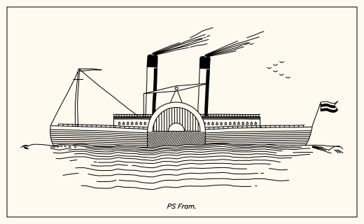

- generates all sorts of ships in profile: square riggers, schooners and sloops, steamers and longships
- outputs polylines (supported format svg, json, csv, etc.)
- full procedural generation, single file no dependencies
- plotter-centric
- export drawing animation:



## usage

basic

```
node shipdraw.js > output.svg
```

specify seed (from a string), speed of drawing and output format:

```
node shipdraw.js --seed "HMS Endeavour" --format smil --speed 2 > output.svg
```

- the seed string is used as the name of the ship (printed in the drawing). If unspecified, a random ship name will be auto generated.
- the name's prefix picks the kind of ship: `SS`, `RMS` and `MV` give a steamer, `HMS` a man-of-war with gunports. Any other name gets a ship chosen by its seed.
- the speed number is used to control the speed of drawing animation. Larger the number is, faster it draws. This option works only with format `smil`.
- format options: `svg` (regular svg), `smil` (animated svg), `csv` (each polyline on a comma-separated line), `json` and `ps`.

in the browser: `index.html` draws a new ship on every visit, seeded by the time of the visit.
`index.html?seed=HMS%20Endeavour` draws a fixed ship. it works on any static host, such as
GitHub Pages, with no build step.

use as JS library:

```js
const {ship,generate_params} = require('./shipdraw.js');
let polylines = ship(generate_params("SS Matilda"));
console.log(polylines);
```


## gallery

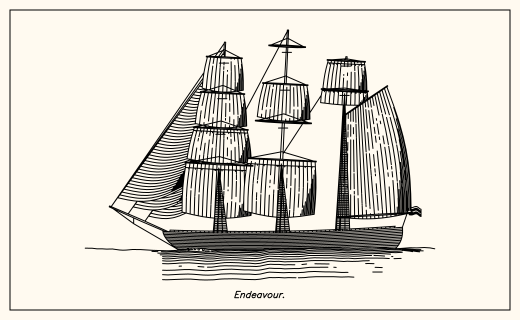
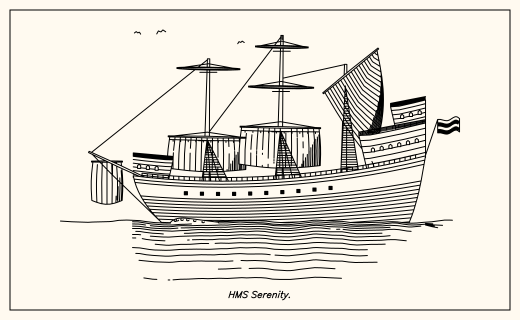
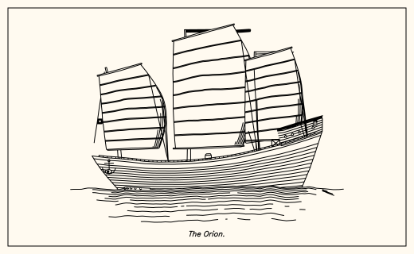
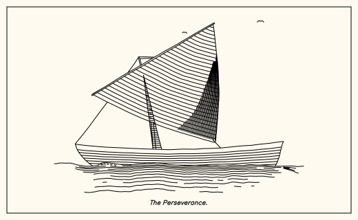
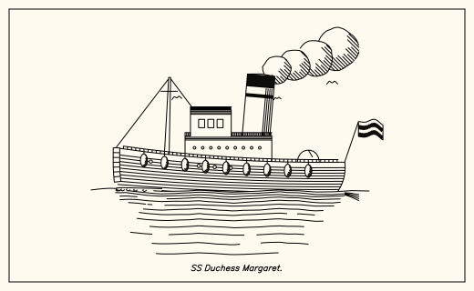
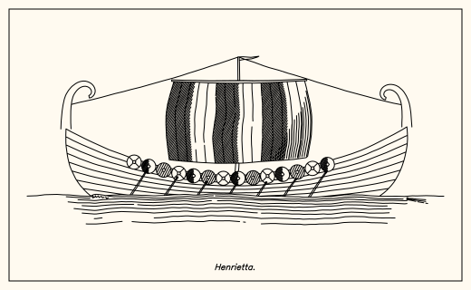
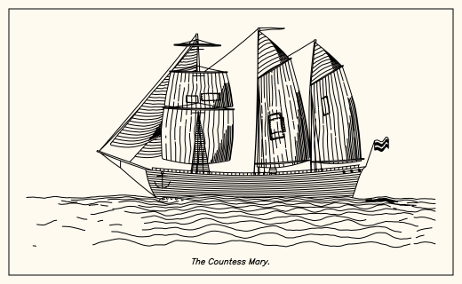
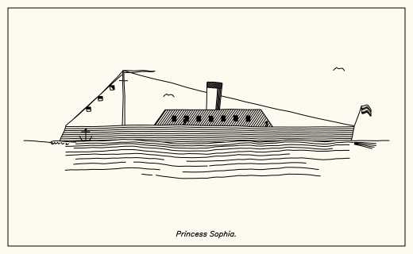
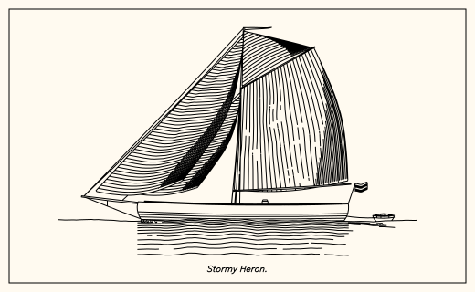
